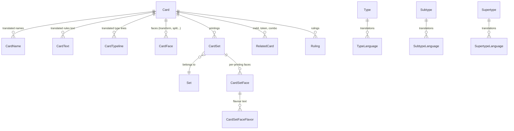

# MTG.Database.Models

[](https://dotnet.microsoft.com/)
[](https://learn.microsoft.com/ef/core/)
[](LICENSE)
[]()

> Shared Entity Framework Core data model for a multilingual Magic: The Gathering card platform.
> Modèle de données Entity Framework Core partagé pour une plateforme multilingue de cartes Magic: The Gathering.

**🇬🇧 [English](#english) · 🇫🇷 [Français](#français)**

---

## English

### What this is

This repository holds the Entity Framework Core entities shared by every component of the project. It contains no business logic and no database provider configuration — only the shape of the data and the relationships between tables.

It is referenced by [MTG.API](https://github.com/arthur-lagenebre/MTG.API) (which owns the `DbContext` and the migrations) and mirrors the target schema the [MTG-Importer](https://github.com/arthur-lagenebre/MTG-Importer) writes into.

### Why it matters

Wizards of the Coast only translates Magic cards into a handful of languages, and only keeps the English text up to date. This project aims to let a community maintain translations in any language. That goal is only reachable if **localisation is a first-class axis of the schema**, not an afterthought bolted onto an English-first design.

Three decisions carry that idea:

**1. Translations are rows, not columns.** `CardName`, `CardText` and `CardTypeline` are separate tables keyed by `(CardId, FaceId, Language, Value)`. Adding a new language means inserting rows — no schema migration, no column explosion, no nullable-column sprawl.

**2. Oracle and printing are separated.** `Card` holds what is true of a card in the abstract (mana cost, colours, layout, power/toughness). `CardSet` holds what is true of one printing (set, collector number, rarity, images), and `CardSetFace` holds what varies per printing *and* per face (flavour text, artists). A card reprinted twenty times has one oracle row and twenty printing rows.

**3. Type lines are composed, not stored as strings.** `Type`, `Subtype` and `Supertype` each have their own translation table. A separate `Typeline` table stores **the separators for each language** (`SeparatorType`, `SeparatorSubtype`, `SeparatorTypeSubtype`).

That last point is the one most MTG databases get wrong. English uses `Creature — Human Wizard`; Japanese and Chinese do not use spaces or em dashes the same way. Storing the separators per language lets the type line be recomposed correctly for any locale instead of hardcoding an English convention.

### Schema overview



| Entity | Role |
|---|---|
| `Card` | Oracle-level card: mana cost, mana value, colours, layout, keywords, P/T, loyalty |
| `CardName` / `CardText` / `CardTypeline` | One row per (card, face, language) — the translation tables |
| `CardFace` | Per-face oracle data for multi-face layouts |
| `CardSet` | One printing of a card in one set |
| `CardSetFace` / `CardSetFaceFlavor` | Artists and flavour text, which vary by printing and face |
| `Set` | A Magic set (name, code, release date) |
| `Type` / `Subtype` / `Supertype` + `*Language` | Type taxonomy and its translations |
| `Typeline` | Per-language separators used to recompose a type line |
| `Color` | Colour reference table, stored as a bitmask (W=2, U=4, B=8, R=16, G=32) |
| `Artist`, `Ruling`, `RelatedCard` | Supporting entities |
| `Tutor/*` | Read-model records aggregating a full card for the front end |

Colours are stored as a bitmask so that a colour identity fits in a single indexed integer column and can be filtered with bitwise operations.

The `Tutor/*` records (`CardTutor`, `LanguageTutor`, `SetTutor`…) are not database entities. They are the flattened, display-oriented projections the API returns, so the front end does not have to recompose eight tables client-side.

### Usage

This project is a class library. It is not meant to run on its own.

```bash
git clone https://github.com/arthur-lagenebre/MTG.Database.Models.git
cd MTG.Database.Models
dotnet build
```

Consumers reference it via a relative `ProjectReference`, which means the repositories must currently be cloned side by side:

```
your-workspace/
├── MTG.Database.Models/
├── MTG.API/
└── MTG-Importer/
```

### Roadmap

- [ ] Migrate to .NET 10 (LTS) and EF Core 10 — .NET 8 support ends 10 November 2026
- [ ] Publish as a NuGet package on GitHub Packages, to drop the side-by-side clone requirement
- [ ] Add auditing fields (`CreatedAt`, `UpdatedAt`, `UpdatedBy`) required by collaborative translation
- [ ] Add a translation history / revision entity for moderation
- [ ] Review primitive-collection mapping (`List<string>`) against EF Core 10 behaviour

### Related repositories

| Repository | Role |
|---|---|
| [MTG-Importer](https://github.com/arthur-lagenebre/MTG-Importer) | Imports Scryfall bulk data into the database via the API |
| [MTG.API](https://github.com/arthur-lagenebre/MTG.API) | REST API, owns the `DbContext` and migrations |
| **MTG.Database.Models** | This repository — shared EF Core model |
| [card-tutor](https://github.com/arthur-lagenebre/card-tutor) | Angular front end |

---

## Français

### De quoi s'agit-il

Ce dépôt contient les entités Entity Framework Core partagées par tous les composants du projet. Il ne contient aucune logique métier ni configuration de fournisseur de base de données — uniquement la forme des données et les relations entre les tables.

Il est référencé par [MTG.API](https://github.com/arthur-lagenebre/MTG.API) (qui porte le `DbContext` et les migrations) et décrit le schéma cible dans lequel écrit l'[MTG-Importer](https://github.com/arthur-lagenebre/MTG-Importer).

### Pourquoi c'est le cœur du projet

Wizards of the Coast ne traduit les cartes Magic que dans quelques langues, et ne met à jour que la version anglaise. L'objectif du projet est de permettre à une communauté de maintenir des traductions dans n'importe quelle langue. Ce n'est atteignable que si **la localisation est un axe de première classe du schéma**, et non un correctif greffé sur une conception pensée en anglais.

Trois décisions portent cette idée :

**1. Les traductions sont des lignes, pas des colonnes.** `CardName`, `CardText` et `CardTypeline` sont des tables séparées portant `(CardId, FaceId, Language, Value)`. Ajouter une langue revient à insérer des lignes — aucune migration de schéma, aucune explosion du nombre de colonnes, aucune prolifération de colonnes nullables.

**2. L'oracle et l'impression sont séparés.** `Card` porte ce qui est vrai d'une carte dans l'absolu (coût de mana, couleurs, layout, force/endurance). `CardSet` porte ce qui est vrai d'une impression donnée (édition, numéro de collection, rareté, images), et `CardSetFace` ce qui varie par impression *et* par face (texte d'ambiance, artistes). Une carte rééditée vingt fois a une ligne d'oracle et vingt lignes d'impression.

**3. Les lignes de type sont composées, pas stockées en chaîne.** `Type`, `Subtype` et `Supertype` ont chacun leur table de traductions. Une table `Typeline` distincte stocke **les séparateurs propres à chaque langue** (`SeparatorType`, `SeparatorSubtype`, `SeparatorTypeSubtype`).

C'est ce dernier point que la plupart des bases MTG ratent. L'anglais écrit `Creature — Human Wizard` ; le japonais et le chinois n'utilisent ni les espaces ni le tiret cadratin de la même façon. Stocker les séparateurs par langue permet de recomposer correctement la ligne de type dans n'importe quelle locale, au lieu de figer une convention anglaise.

### Aperçu du schéma

Voir le diagramme dans la section anglaise ci-dessus.

| Entité | Rôle |
|---|---|
| `Card` | Carte au niveau oracle : coût de mana, valeur de mana, couleurs, layout, mots-clés, F/E, loyauté |
| `CardName` / `CardText` / `CardTypeline` | Une ligne par (carte, face, langue) — les tables de traduction |
| `CardFace` | Données oracle par face pour les layouts multi-faces |
| `CardSet` | Une impression d'une carte dans une édition |
| `CardSetFace` / `CardSetFaceFlavor` | Artistes et texte d'ambiance, qui varient par impression et par face |
| `Set` | Une édition Magic (nom, code, date de sortie) |
| `Type` / `Subtype` / `Supertype` + `*Language` | Taxonomie des types et ses traductions |
| `Typeline` | Séparateurs par langue permettant de recomposer une ligne de type |
| `Color` | Table de référence des couleurs, stockées en masque de bits (W=2, U=4, B=8, R=16, G=32) |
| `Artist`, `Ruling`, `RelatedCard` | Entités support |
| `Tutor/*` | Modèles de lecture agrégeant une carte complète pour le front |

Les couleurs sont stockées en masque de bits afin qu'une identité colorielle tienne dans une seule colonne entière indexable et se filtre par opérations bit à bit.

Les records `Tutor/*` (`CardTutor`, `LanguageTutor`, `SetTutor`…) ne sont pas des entités de base de données. Ce sont les projections aplaties et orientées affichage que renvoie l'API, pour éviter au front de recomposer huit tables côté client.

### Utilisation

Ce projet est une bibliothèque de classes. Il n'est pas destiné à s'exécuter seul.

```bash
git clone https://github.com/arthur-lagenebre/MTG.Database.Models.git
cd MTG.Database.Models
dotnet build
```

Les consommateurs le référencent via un `ProjectReference` relatif, ce qui impose pour l'instant de cloner les dépôts côte à côte :

```
votre-workspace/
├── MTG.Database.Models/
├── MTG.API/
└── MTG-Importer/
```

### Feuille de route

- [ ] Migrer vers .NET 10 (LTS) et EF Core 10 — le support de .NET 8 s'arrête le 10 novembre 2026
- [ ] Publier en package NuGet sur GitHub Packages, pour supprimer la contrainte de clonage côte à côte
- [ ] Ajouter les champs d'audit (`CreatedAt`, `UpdatedAt`, `UpdatedBy`) qu'exige la traduction collaborative
- [ ] Ajouter une entité d'historique des révisions pour la modération
- [ ] Vérifier le mapping des collections primitives (`List<string>`) face au comportement d'EF Core 10

### Dépôts liés

| Dépôt | Rôle |
|---|---|
| [MTG-Importer](https://github.com/arthur-lagenebre/MTG-Importer) | Importe les données Scryfall dans la base via l'API |
| [MTG.API](https://github.com/arthur-lagenebre/MTG.API) | API REST, porte le `DbContext` et les migrations |
| **MTG.Database.Models** | Ce dépôt — modèle EF Core partagé |
| [card-tutor](https://github.com/arthur-lagenebre/card-tutor) | Front Angular |

---

## License / Licence

Code released under the [MIT License](LICENSE).
Code publié sous [licence MIT](LICENSE).

### Fan content disclaimer

This project is unofficial Fan Content permitted under the Wizards of the Coast Fan Content Policy. Not approved or endorsed by Wizards. Portions of the materials used are property of Wizards of the Coast. © Wizards of the Coast LLC.

Card data originates from [Scryfall](https://scryfall.com/). Any information obtained from the Scryfall API that is not © Wizards of the Coast LLC is © Scryfall LLC. The MIT licence above covers **this repository's source code only** — it does not extend to card data, card names, rules text, artwork or Magic: The Gathering trademarks.

*Ce projet est un contenu de fan non officiel, autorisé au titre de la Fan Content Policy de Wizards of the Coast. Non approuvé ni soutenu par Wizards. La licence MIT ci-dessus couvre uniquement le code source de ce dépôt : elle ne s'étend ni aux données des cartes, ni aux noms, textes de règles, illustrations ou marques Magic: The Gathering.*
